# My Dotfiles

<div align = "center">
    
</div> <br>

**Language**

- 🇪🇸 [Spanish](./README.md)
- 🇬🇧 English

This is my _personal setup_ for qtile. This setup is made on Arch Linux.
To install qtile with the plugins I use and configure the desktop like mine, run the following commands on Arch Linux or any Arch-based distro:

```bash
sudo pacman -Sy qtile, fish, kitty, picom, rofi, yazi, thunar, neovim, networkmanager, pamac, xfce4-power-manager, numlockx, blueberry, volumeicon, lxappearance, waypaper, feh, fastfetch
git clone https://github.com/rafafons29/dotfiles.git
cd dotfiles 
cp -r * ~/.config/
```

Once done, reboot, launch qtile, and press `Super+Enter` to open kitty; in this case, `Super` is the same as the Windows key on most laptops. Then run the following command to configure the prompt using tide. If you prefer to use another shell like zsh or bash or use ohmyfish for the prompt, you need to configure that yourself, skipping this step.

```bash
curl -sL https://raw.githubusercontent.com/jorgebucaran/fisher/main/functions/fisher.fish | source && fisher install jorgebucaran/fisher
fisher install IlanCosman/tide@v6
tide configure
```

Details of my setup:

- Window Manager: [qtile](https://qtile.org/)
- Shell: [fish](https://fishshell.com/) with [tide](https://github.com/IlanCosman/tide)
- Terminal:  [kitty](https://sw.kovidgoyal.net/kitty/)
- Compositor: [picom](https://github.com/yshui/picom) 
- Application Launcher: [rofi](https://github.com/davatorium/rofi)
- File Manager: [yazi](https://yazi-rs.github.io/) terminal file manager, [thunar](https://docs.xfce.org/xfce/thunar/the-file-manager-window) graphical file manager.
- Text Editor: [Neovim](https://neovim.io/), [My Neovim configuration](https://github.com/rafafons29/nvim_config)

In this setup, I use 6 color themes with two different styles: one is the status bar at the top (top_style_bar in screen within qtile) and the other with the bottom bar (buttom_minimal_bar) in screen within qtile. The color themes are listed below.

##  Themes

<div align="center">
    <table align="center"><strong>Andromeda🎨</strong>
        <tr>
            <td>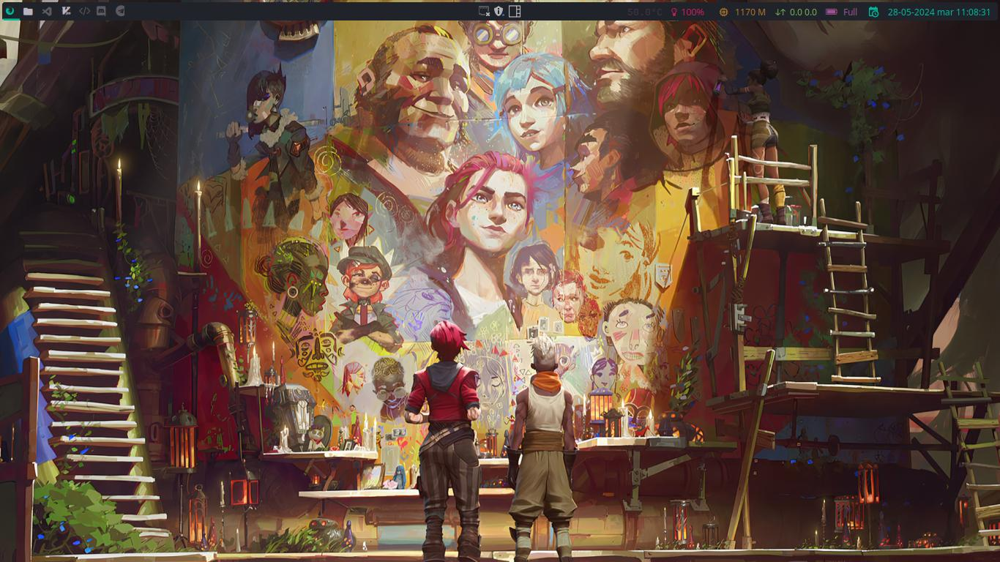</td>
            <td>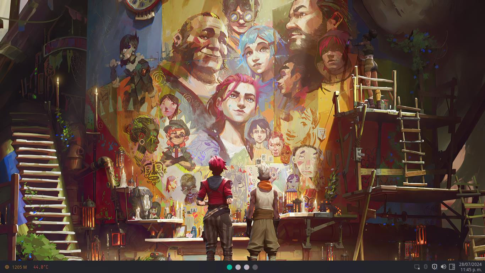</td>
        </tr>
    </table>
    <table align="center"><strong>Onedark🎨</strong>
        <tr>
            <td>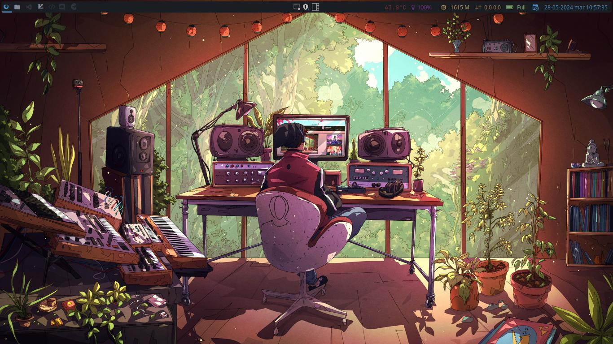</td>
            <td>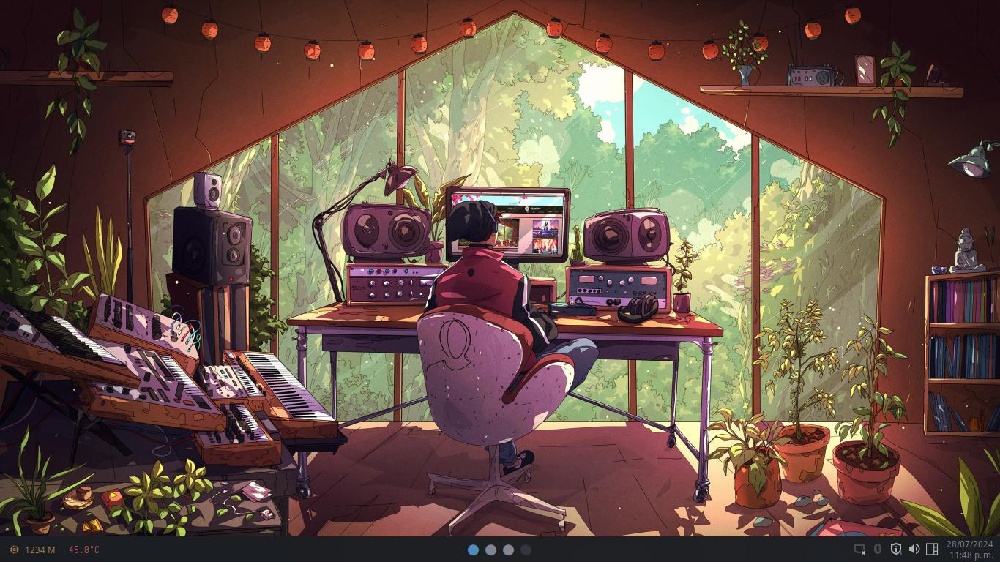</td>
        </tr>
    </table>
    <table align="center"><strong>Palenight🎨</strong>
        <tr>
            <td>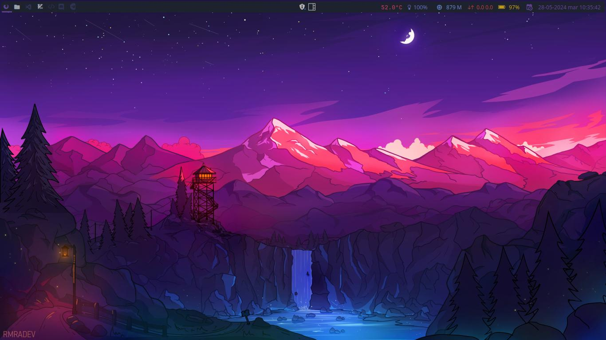</td>
            <td></td>
        </tr>
    </table>
    <table align="center"><strong>Catppucin🎨</strong>
        <tr>
            <td>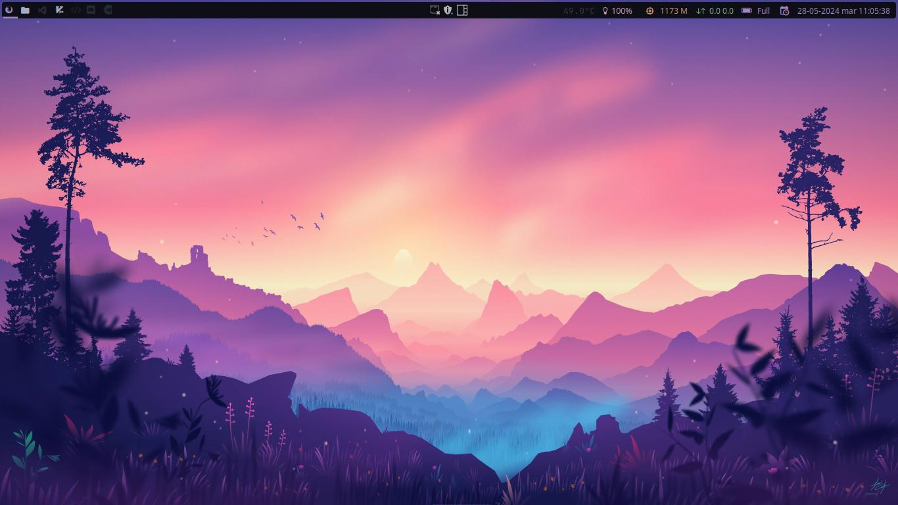</td>
            <td>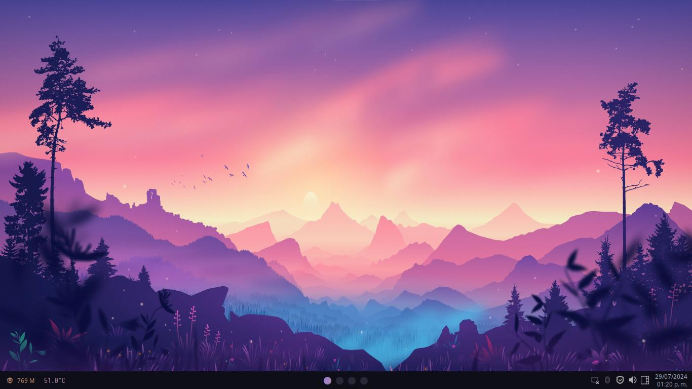</td>
        </tr>
    </table>
    <table align="center"><strong>Oxocarbon🎨</strong>
        <tr>
            <td>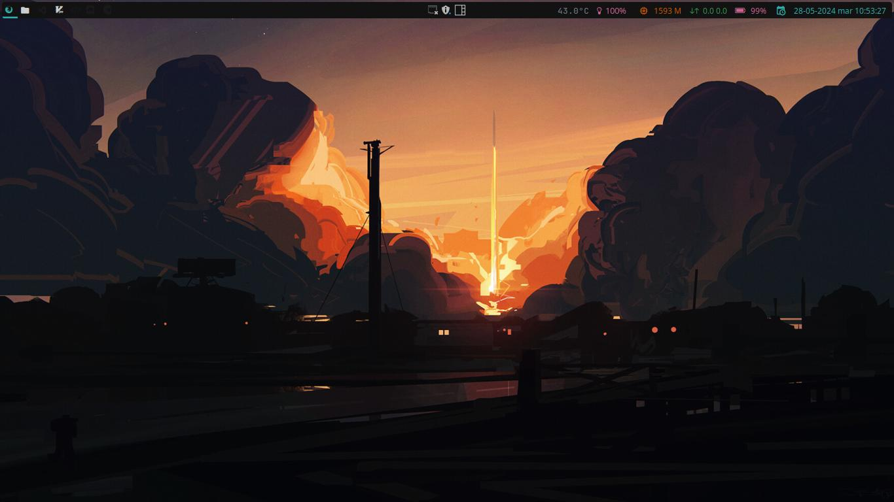</td>
            <td>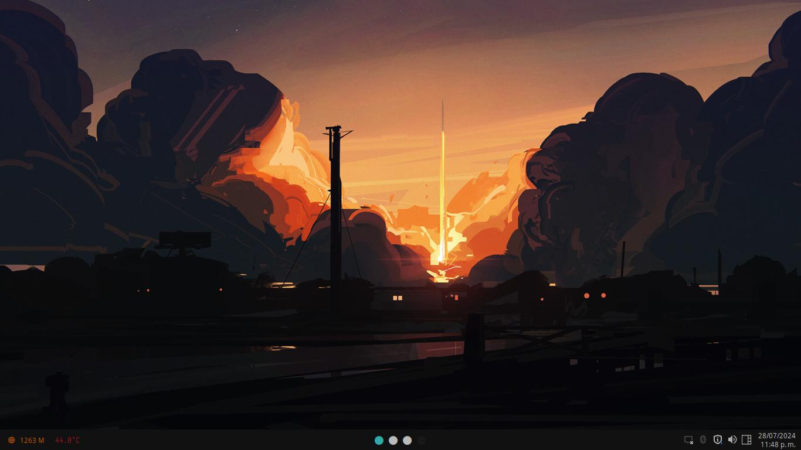</td>
        </tr>
    </table>
    <table align="center"><strong>Tokyonight🎨</strong>
        <tr>
            <td>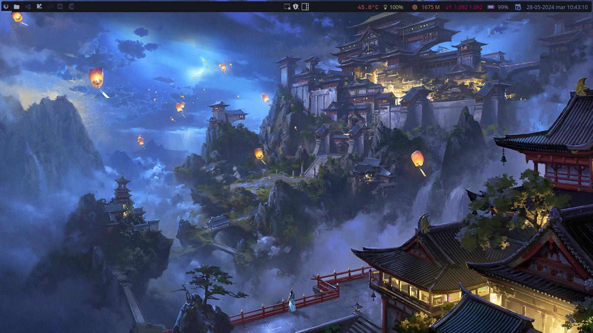</td>
            <td>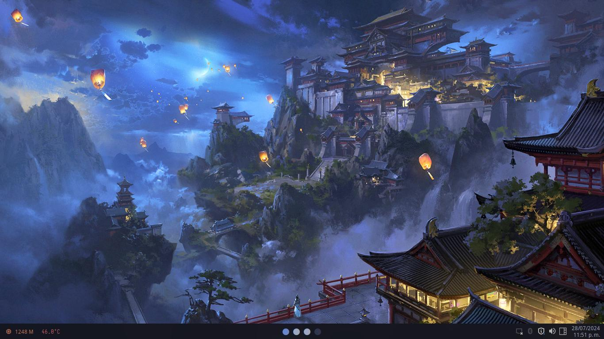</td>
        </tr>
    </table>
</div>

## Keyboard Shortcuts

<div align="center">

| Keys                                                                        | Action                                      |
| --------------------------------------------------------------------------- | ------------------------------------------- |
| <kbd>Super</kbd> + <kbd>q</kbd>                                             | Close focused window                        |
| <kbd>Super</kbd> + <kbd>v</kbd>                                             | Toggle floating window                      |
| <kbd>Super</kbd> + <kbd>g</kbd>                                             | Run Flameshot                               |
| <kbd>Super</kbd> + <kbd>f</kbd>                                             | Show/Hide Bar                               |
| <kbd>Super</kbd> + <kbd>Shift</kbd> + <kbd>f</kbd>                          | Toggle Fullscreen Window                    |
| <kbd>Super</kbd> + <kbd>Enter</kbd>                                         | Launch terminal emulator (kitty)            |
| <kbd>Super</kbd> + <kbd>e</kbd>                                             | Launch file manager (yazi)                  |
| <kbd>Super</kbd> + <kbd>Shift</kbd> + <kbd>e</kbd>                          | Launch file manager (thunar)                |
| <kbd>Super</kbd> + <kbd>b</kbd>                                             | Launch web browser (firefox)                |
| <kbd>Super</kbd> + <kbd>m</kbd>                                             | Launch application launcher (rofi)          |
| <kbd>Super</kbd> + <kbd>d</kbd>                                             | Launch application launcher (rofi)          |
| <kbd>Super</kbd> + <kbd>x</kbd>                                             | Logout                                      |
| <kbd>Print</kbd>                                                            | Screenshot capture                          |
| <kbd>Super</kbd> + <kbd>K</kbd>                                             | Switch keyboard layout                      |
| <kbd>Alt</kbd> + <kbd>Tab</kbd>                                             | Change workspace focus                      |
| <kbd>Super</kbd> + <kbd>[0-9]</kbd>                                         | Switch workspaces                           |
| <kbd>Super</kbd> + <kbd>Space</kbd>                                         | Next Layout                                 |
| <kbd>Super</kbd> + <kbd>l</kbd>                                             | Move focus to right windows                 |
| <kbd>Super</kbd> + <kbd>h</kbd>                                             | Move focus to left windows                  |
| <kbd>Super</kbd> + <kbd>k</kbd>                                             | Move focus to up windows                    |
| <kbd>Super</kbd> + <kbd>j</kbd>                                             | Move focus down windows                     |
| <kbd>Super</kbd> + <kbd>Ctrl</kbd> + <kbd>l</kbd>                           | Resize windows to right                     |
| <kbd>Super</kbd> + <kbd>Ctrl</kbd> + <kbd>h</kbd>                           | Resize windows to left                      |
| <kbd>Super</kbd> + <kbd>Ctrl</kbd> + <kbd>k</kbd>                           | Resize windows up                           |
| <kbd>Super</kbd> + <kbd>Ctrl</kbd> + <kbd>j</kbd>                           | Resize windows down                         |
| <kbd>Super</kbd> + <kbd>Shift</kbd> + <kbd>l</kbd>                          | Move windows to right                       |
| <kbd>Super</kbd> + <kbd>Shift</kbd> + <kbd>h</kbd>                          | Move windows to left                        |
| <kbd>Super</kbd> + <kbd>Shift</kbd> + <kbd>k</kbd>                          | Move windows up                             |
| <kbd>Super</kbd> + <kbd>Shift</kbd> + <kbd>j</kbd>                          | Move windows down                           |
| <kbd>Super</kbd> + <kbd>Shift</kbd> + <kbd>r</kbd>                          | Restart                                     |
| <kbd>Super</kbd> + <kbd>Shift</kbd> + <kbd>[0-9]</kbd>                      | Move focused window to a relative workspace |
| <kbd>Super</kbd> + <kbd>LeftClick</kbd>                                     | Move focused window                         |
| <kbd>Super</kbd> + <kbd>RightClick</kbd>                                    | Resize focused window                       |

</div>
