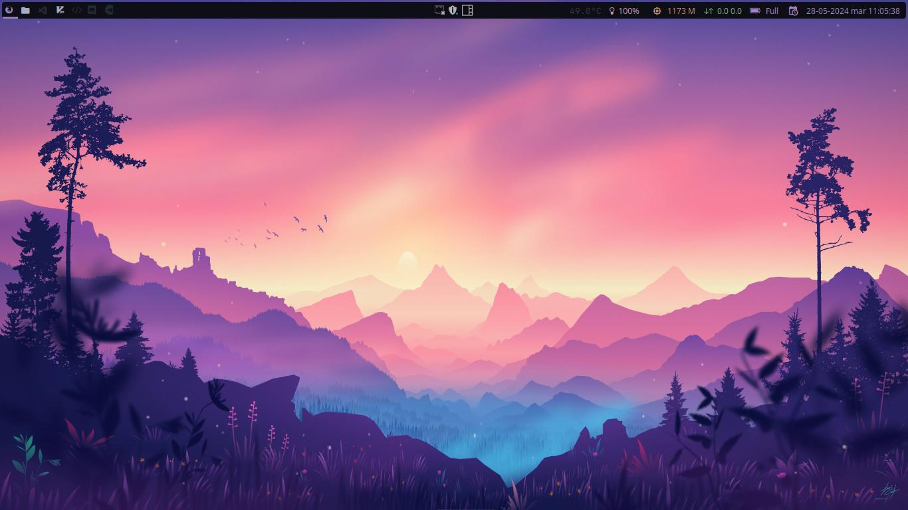
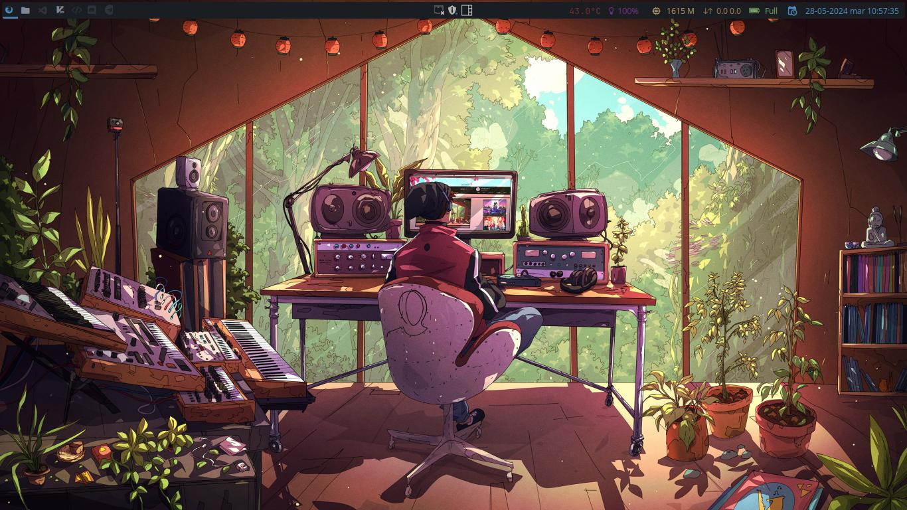
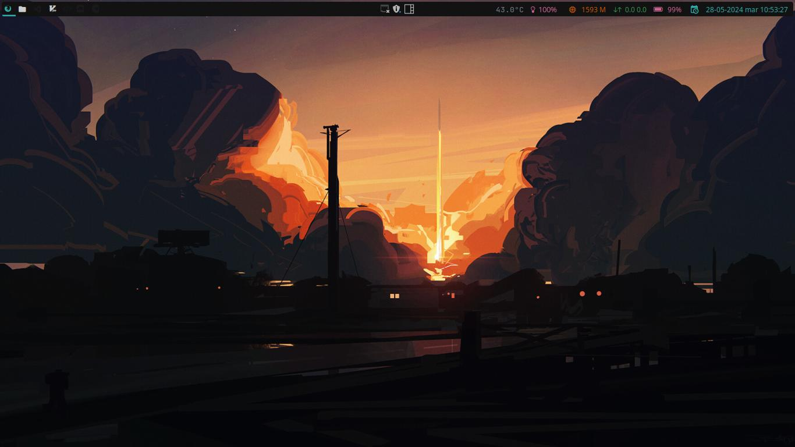
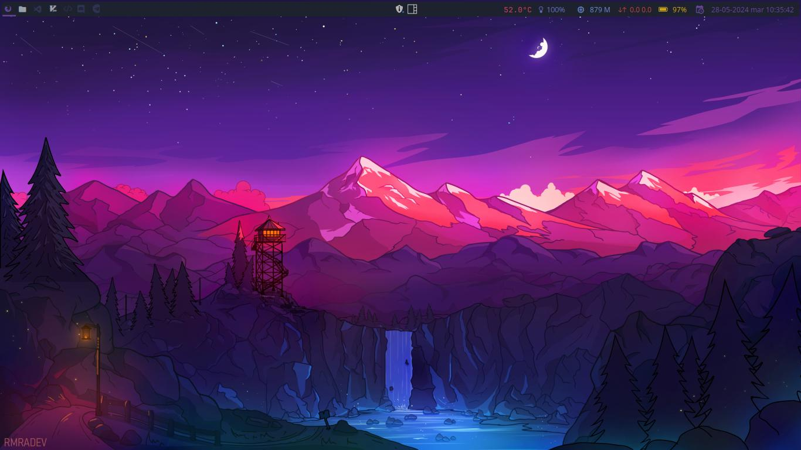
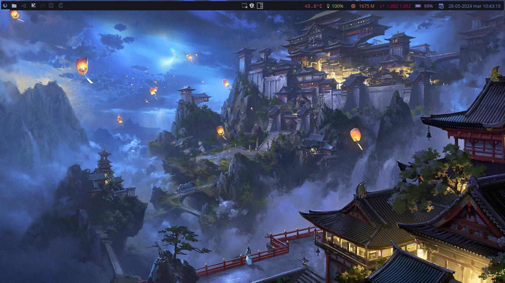

# My Dotfiles

    

  

<!-- To install, execute the following commands: -->
<!-- asdjbas -->

## Styles

    <table>
        

            <tr>
                <td>Andromeda</td>
                <td>Catppucin</td>
            </tr>
        

        

            <tr>
                <td>Onedark</td>
                <td>Oxocarbon</td>
            </tr>
        

        

            <tr>
                <td>Palenight</td>
                <td>Tokyonight</td>
            </tr>
        

    </table>

## Keybindings

| Keys                                                                        | Action                                      |
| :-------------------------------------------------------------------------- | :------------------------------------------ |
| <kbd>Super</kbd> + <kbd>q</kbd>                                             | Close focused window                        |
| <kbd>Super</kbd> + <kbd>v</kbd>                                             | Toggle floating window                      |
| <kbd>Super</kbd> + <kbd>g</kbd>                                             | Run Flameshot                               |
| <kbd>Super</kbd> + <kbd>f</kbd>                                             | Hide Show Bar                               |
| <kbd>Super</kbd> + <kbd>Shift</kbd> + <kbd>f</kbd>                          | Toggle Window Fullscreen                    |
| <kbd>Super</kbd> + <kbd>Enter</kbd>                                         | Launch terminal emulator (kitty)            |
| <kbd>Super</kbd> + <kbd>e</kbd>                                             | Launch file manager (yazi)                  |
| <kbd>Super</kbd> + <kbd>Shift</kbd> + <kbd>e</kbd>                          | Launch file manager (thunar)                |
| <kbd>Super</kbd> + <kbd>b</kbd>                                             | Launch web browser (firefox)                |
| <kbd>Super</kbd> + <kbd>m</kbd>                                             | Launch application launcher (rofi)          |
| <kbd>Super</kbd> + <kbd>Shift</kbd> + <kbd>m</kbd>                          | Launch window switcher (rofi)               |
| <kbd>Print</kbd>                                                            | Screenshot capture                          |
| <kbd>Super</kbd> + <kbd>K</kbd>                                             | Switch keyboard layout                      |
| <kbd>Super</kbd> + <kbd>←</kbd><kbd>→</kbd><kbd>↑</kbd><kbd>↓</kbd>         | Move window focus                           |
| <kbd>Alt</kbd> + <kbd>Tab</kbd>                                             | Change workspaces focus                     |
| <kbd>Super</kbd> + <kbd>[0-9]</kbd>                                         | Switch workspaces                           |
| <kbd>Super</kbd> + <kbd>Space</kbd>                                         | Next Layout                                 |
| <kbd>Super</kbd> + <kbd>l</kbd>                                             | Move focus to right windows                 |
| <kbd>Super</kbd> + <kbd>h</kbd>                                             | Move focus to left windows                  |
| <kbd>Super</kbd> + <kbd>k</kbd>                                             | Move focus to up windows                    |
| <kbd>Super</kbd> + <kbd>j</kbd>                                             | Move focus down windows                     |
| <kbd>Super</kbd> + <kbd>Ctrl</kbd> + <kbd>l</kbd>                           | Resize windows to right                     |
| <kbd>Super</kbd> + <kbd>Ctrl</kbd> + <kbd>h</kbd>                           | Resize windows to left                      |
| <kbd>Super</kbd> + <kbd>Ctrl</kbd> + <kbd>k</kbd>                           | Resize windows to up                        |
| <kbd>Super</kbd> + <kbd>Ctrl</kbd> + <kbd>j</kbd>                           | Resize windows to down                      |
| <kbd>Super</kbd> + <kbd>Shift</kbd> + <kbd>l</kbd>                          | Move windows to right                       |
| <kbd>Super</kbd> + <kbd>Shift</kbd> + <kbd>h</kbd>                          | Move windows to left                        |
| <kbd>Super</kbd> + <kbd>Shift</kbd> + <kbd>k</kbd>                          | Move windows to up                          |
| <kbd>Super</kbd> + <kbd>Shift</kbd> + <kbd>j</kbd>                          | Move windows to down                        |
| <kbd>Super</kbd> + <kbd>Shift</kbd> + <kbd>r</kbd>                          | Restart                                     |
| <kbd>Super</kbd> + <kbd>Shift</kbd> + <kbd>[0-9]</kbd>                      | Move focused window to a relative workspace |
| <kbd>Super</kbd> + <kbd>MouseScroll</kbd>                                   | Scroll through existing workspaces          |
| <kbd>Super</kbd> + <kbd>LeftClick</kbd> <kbd>Super</kbd> + <kbd>Z</kbd>  | Move focused window                         |
| <kbd>Super</kbd> + <kbd>RightClick</kbd> <kbd>Super</kbd> + <kbd>X</kbd> | Resize focused window                       |

