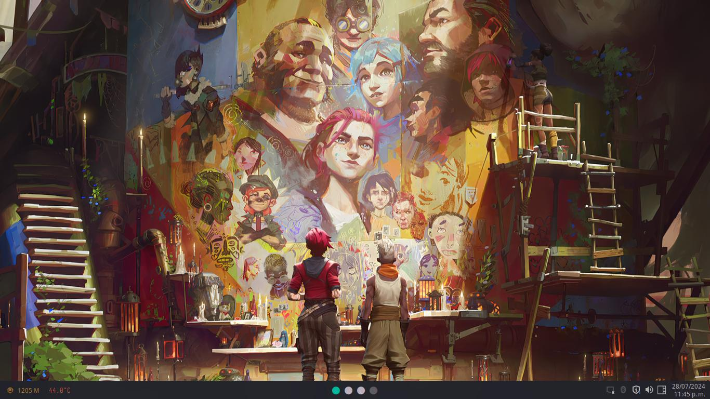
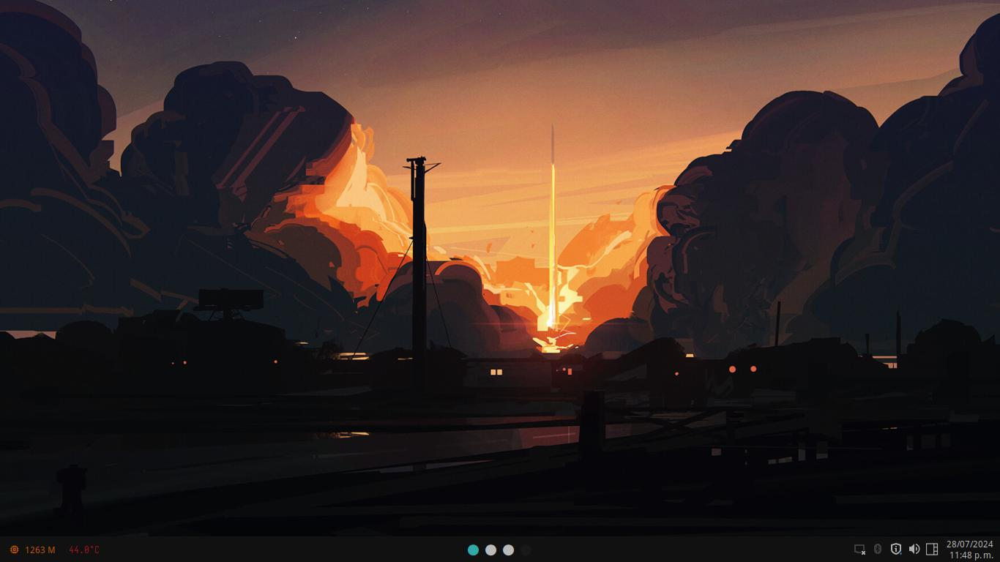

# My Dotfiles

<div align = "center">
    
</div> <br>

Esta es mi _configuracion pesonal_ para mi window manajer favorito. Esta configuracion esta hecha en archlinux.
Para instalar qtile con los complementos que uso y configurar el escritorio como el mio, ejecuta los siguientes comandos en archlinux o alguna distro basada en archlinux:

```bash
sudo pacman -Sy qtile, fish, kitty, picom, rofi, yazi, thunar, neovim, networkmanager, pamac, xfce4-power-manager, numlockx, blueberry, volumeicon, lxappearance, waypaper, feh, fastfetch
git clone https://github.com/rafafons29/dotfiles.git
cd dotfiles 
cp -r * ~/.config/
curl -sL https://raw.githubusercontent.com/jorgebucaran/fisher/main/functions/fisher.fish | source && fisher install jorgebucaran/fisher
fisher install IlanCosman/tide@v6
tide configure
```

**Detalles de mi setup:**

- **Window Manajer:** [qtile](https://qtile.org/)
- **Shell:** [fish](https://fishshell.com/) con [tide](https://github.com/IlanCosman/tide)
- **Terminal:**  [kitty](https://sw.kovidgoyal.net/kitty/)
- **Compositor:** [picom](https://github.com/yshui/picom) 
- **Lanzador de aplicaciones:** [rofi](https://github.com/davatorium/rofi)
- **Gestor de archivos:** [yazi](https://yazi-rs.github.io/) gestor de archivos en la terminal, [thunar](https://docs.xfce.org/xfce/thunar/the-file-manager-window) getor de archivos grafico.
- **Editor de texto:** [Neovim](https://neovim.io/), [Mi configuracion de neovim](https://github.com/rafafons29/nvim_config)

## Estilos 

<div class="themes">
    <table>
        <div align="center"> Andromeda
            <tr>
                <td></td>
                <td></td>
            </tr>
        </div>
    </table>
    <table>
        <div align="center"> Onedark
            <tr>
                <td></td>
                <td></td>
            </tr>
        </div>
    </table>
    <table>
        <div align="center"> Palenight
            <tr>
                <td></td>
                <td></td>
            </tr>
        </div>
    </table>
    <table>
        <div align="center"> Catppucin 
            <tr>
                <td></td>
                <td></td>
            </tr>
        </div>
    </table>
    <table>
        <div align="center"> Oxocarbon
            <tr>
                <td></td>
                <td></td>
            </tr>
        </div>
    </table>
    <table>
        <div align="center"> Tokyonight
            <tr>
                <td></td>
                <td></td>
            </tr>
        </div>
    </table>
</div>

## Atajos de teclado

<div align="center">

| Keys                                                                        | Action                                      |
| --------------------------------------------------------------------------- | ------------------------------------------- |
| <kbd>Super</kbd> + <kbd>q</kbd>                                             | Close focused window                        |
| <kbd>Super</kbd> + <kbd>v</kbd>                                             | Toggle floating window                      |
| <kbd>Super</kbd> + <kbd>g</kbd>                                             | Run Flameshot                               |
| <kbd>Super</kbd> + <kbd>f</kbd>                                             | Hide Show Bar                               |
| <kbd>Super</kbd> + <kbd>Shift</kbd> + <kbd>f</kbd>                          | Toggle Window Fullscreen                    |
| <kbd>Super</kbd> + <kbd>Enter</kbd>                                         | Launch terminal emulator (kitty)            |
| <kbd>Super</kbd> + <kbd>e</kbd>                                             | Launch file manager (yazi)                  |
| <kbd>Super</kbd> + <kbd>Shift</kbd> + <kbd>e</kbd>                          | Launch file manager (thunar)                |
| <kbd>Super</kbd> + <kbd>b</kbd>                                             | Launch web browser (firefox)                |
| <kbd>Super</kbd> + <kbd>m</kbd>                                             | Launch application launcher (rofi)          |
| <kbd>Super</kbd> + <kbd>Shift</kbd> + <kbd>m</kbd>                          | Launch window switcher (rofi)               |
| <kbd>Print</kbd>                                                            | Screenshot capture                          |
| <kbd>Super</kbd> + <kbd>K</kbd>                                             | Switch keyboard layout                      |
| <kbd>Super</kbd> + <kbd>←</kbd><kbd>→</kbd><kbd>↑</kbd><kbd>↓</kbd>         | Move window focus                           |
| <kbd>Alt</kbd> + <kbd>Tab</kbd>                                             | Change workspaces focus                     |
| <kbd>Super</kbd> + <kbd>[0-9]</kbd>                                         | Switch workspaces                           |
| <kbd>Super</kbd> + <kbd>Space</kbd>                                         | Next Layout                                 |
| <kbd>Super</kbd> + <kbd>l</kbd>                                             | Move focus to right windows                 |
| <kbd>Super</kbd> + <kbd>h</kbd>                                             | Move focus to left windows                  |
| <kbd>Super</kbd> + <kbd>k</kbd>                                             | Move focus to up windows                    |
| <kbd>Super</kbd> + <kbd>j</kbd>                                             | Move focus down windows                     |
| <kbd>Super</kbd> + <kbd>Ctrl</kbd> + <kbd>l</kbd>                           | Resize windows to right                     |
| <kbd>Super</kbd> + <kbd>Ctrl</kbd> + <kbd>h</kbd>                           | Resize windows to left                      |
| <kbd>Super</kbd> + <kbd>Ctrl</kbd> + <kbd>k</kbd>                           | Resize windows to up                        |
| <kbd>Super</kbd> + <kbd>Ctrl</kbd> + <kbd>j</kbd>                           | Resize windows to down                      |
| <kbd>Super</kbd> + <kbd>Shift</kbd> + <kbd>l</kbd>                          | Move windows to right                       |
| <kbd>Super</kbd> + <kbd>Shift</kbd> + <kbd>h</kbd>                          | Move windows to left                        |
| <kbd>Super</kbd> + <kbd>Shift</kbd> + <kbd>k</kbd>                          | Move windows to up                          |
| <kbd>Super</kbd> + <kbd>Shift</kbd> + <kbd>j</kbd>                          | Move windows to down                        |
| <kbd>Super</kbd> + <kbd>Shift</kbd> + <kbd>r</kbd>                          | Restart                                     |
| <kbd>Super</kbd> + <kbd>Shift</kbd> + <kbd>[0-9]</kbd>                      | Move focused window to a relative workspace |
| <kbd>Super</kbd> + <kbd>MouseScroll</kbd>                                   | Scroll through existing workspaces          |
| <kbd>Super</kbd> + <kbd>LeftClick</kbd><br><kbd>Super</kbd> + <kbd>Z</kbd>  | Move focused window                         |
| <kbd>Super</kbd> + <kbd>RightClick</kbd><br><kbd>Super</kbd> + <kbd>X</kbd> | Resize focused window                       |

</div>
