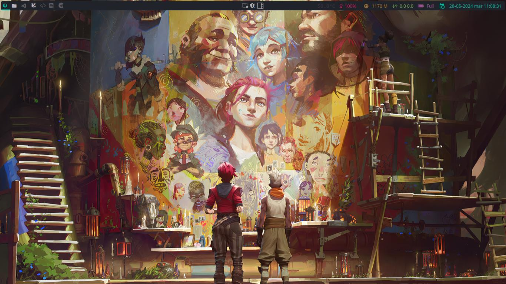
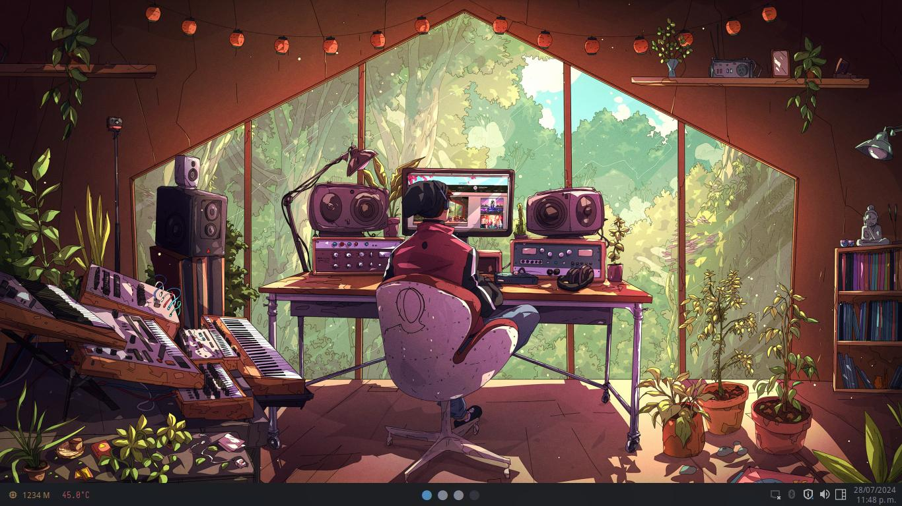
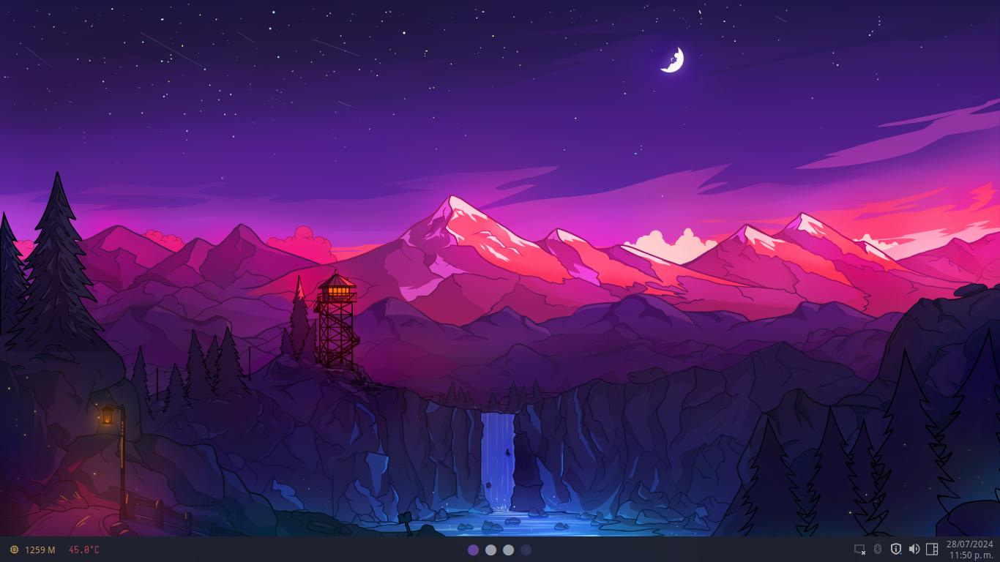
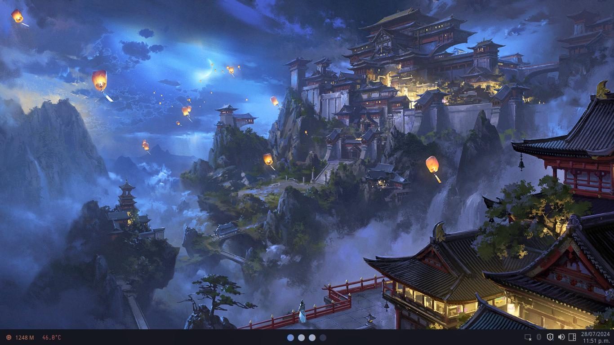

# Mis Dotfiles

<div align = "center">
    
</div> <br>

**Idioma**

- 🇪🇸 Español
- [🇬🇧 Inglés](./README.en.md)

Esta es mi _configuración personal_ para qtile. Esta configuración está hecha en Arch Linux.
Para instalar qtile con los complementos que uso y configurar el escritorio como el mío, ejecuta los siguientes comandos en Arch Linux o alguna distro basada en Arch Linux:

```bash
sudo pacman -Sy qtile, fish, kitty, picom, rofi, yazi, thunar, neovim, networkmanager, pamac, xfce4-power-manager, numlockx, blueberry, volumeicon, lxappearance, waypaper, feh, fastfetch
git clone https://github.com/rafafons29/dotfiles.git
cd dotfiles 
cp -r * ~/.config/
```

Una vez hecho esto, reinicia, ejecuta qtile y pulsando `Super+Enter` ejecutas kitty, en este caso `Super` es lo mismo que la tecla Windows en la mayoría de laptops. Luego ejecuta el siguiente comando para configurar el prompt usando tide. Si prefieres usar otro shell como zsh o bash o usar ohmyfish para el prompt, debes hacer la configuración por ti mismo, omitiendo este paso.

```bash
curl -sL https://raw.githubusercontent.com/jorgebucaran/fisher/main/functions/fisher.fish | source && fisher install jorgebucaran/fisher
fisher install IlanCosman/tide@v6
tide configure
```

Detalles de mi configuración:

- Gestor de Ventanas: [qtile](https://qtile.org/)
- Shell: [fish](https://fishshell.com/) con [tide](https://github.com/IlanCosman/tide)
- Terminal:  [kitty](https://sw.kovidgoyal.net/kitty/)
- Compositor: [picom](https://github.com/yshui/picom) 
- Lanzador de Aplicaciones: [rofi](https://github.com/davatorium/rofi)
- Gestor de Archivos: [yazi](https://yazi-rs.github.io/) gestor de archivos en la terminal, [thunar](https://docs.xfce.org/xfce/thunar/the-file-manager-window) gestor de archivos gráfico.
- Editor de Texto: [Neovim](https://neovim.io/), [Mi configuración de neovim](https://github.com/rafafons29/nvim_config)

En esta configuración uso 6 temas de color con dos estilos diferentes, uno es la barra de estado en la parte superior (top_style_bar en screen dentro de qtile) y el otro con la barra inferior (buttom_minimal_bar en screen dentro de qtile). Los temas de color se listan a continuación.

##  Temas

<div align="center">
    <table align="center"><strong>Andromeda🎨</strong>
        <tr>
            <td></td>
            <td></td>
        </tr>
    </table>
    <table align="center"><strong>Onedark🎨</strong>
        <tr>
            <td></td>
            <td></td>
        </tr>
    </table>
    <table align="center"><strong>Palenight🎨</strong>
        <tr>
            <td></td>
            <td></td>
        </tr>
    </table>
    <table align="center"><strong>Catppucin🎨</strong>
        <tr>
            <td></td>
            <td></td>
        </tr>
    </table>
    <table align="center"><strong>Oxocarbon🎨</strong>
        <tr>
            <td></td>
            <td></td>
        </tr>
    </table>
    <table align="center"><strong>Tokyonight🎨</strong>
        <tr>
            <td></td>
            <td></td>
        </tr>
    </table>
</div>

## Atajos de teclado

<div align="center">


| Teclas                                                                      | Acción                                      |
| ----------------------------------------------------------------------------| ------------------------------------------- |
| <kbd>Super</kbd> + <kbd>q</kbd>                                             | Cerrar ventana enfocada                     |
| <kbd>Super</kbd> + <kbd>v</kbd>                                             | Alternar ventana flotante                   |
| <kbd>Super</kbd> + <kbd>g</kbd>                                             | Ejecutar Flameshot                          |
| <kbd>Super</kbd> + <kbd>f</kbd>                                             | Mostrar/Ocultar barra                       |
| <kbd>Super</kbd> + <kbd>Shift</kbd> + <kbd>f</kbd>                          | Alternar pantalla completa                  |
| <kbd>Super</kbd> + <kbd>Enter</kbd>                                         | Lanzar terminal (kitty)                     |
| <kbd>Super</kbd> + <kbd>e</kbd>                                             | Lanzar gestor de archivos (yazi)            |
| <kbd>Super</kbd> + <kbd>Shift</kbd> + <kbd>e</kbd>                          | Lanzar gestor de archivos (thunar)          |
| <kbd>Super</kbd> + <kbd>b</kbd>                                             | Lanzar navegador web (firefox)              |
| <kbd>Super</kbd> + <kbd>m</kbd>                                             | Lanzar lanzador de aplicaciones (rofi)      |
| <kbd>Super</kbd> + <kbd>d</kbd>                                             | Lanzar lanzador de aplicaciones (rofi)      |
| <kbd>Super</kbd> + <kbd>x</kbd>                                             | Cerrar sesión                               |
| <kbd>Print</kbd>                                                            | Captura de pantalla                         |
| <kbd>Super</kbd> + <kbd>K</kbd>                                             | Cambiar diseño del teclado                  |
| <kbd>Alt</kbd> + <kbd>Tab</kbd>                                             | Cambiar enfoque entre espacios de trabajo   |
| <kbd>Super</kbd> + <kbd>[0-9]</kbd>                                         | Cambiar entre espacios de trabajo           |
| <kbd>Super</kbd> + <kbd>Space</kbd>                                         | Siguiente diseño                            |
| <kbd>Super</kbd> + <kbd>l</kbd>                                             | Mover enfoque a ventanas de la derecha      |
| <kbd>Super</kbd> + <kbd>h</kbd>                                             | Mover enfoque a ventanas de la izquierda    |
| <kbd>Super</kbd> + <kbd>k</kbd>                                             | Mover enfoque a ventanas superiores         |
| <kbd>Super</kbd> + <kbd>j</kbd>                                             | Mover enfoque a ventanas inferiores         |
| <kbd>Super</kbd> + <kbd>Ctrl</kbd> + <kbd>l</kbd>                           | Redimensionar ventanas a la derecha         |
| <kbd>Super</kbd> + <kbd>Ctrl</kbd> + <kbd>h</kbd>                           | Redimensionar ventanas a la izquierda       |
| <kbd>Super</kbd> + <kbd>Ctrl</kbd> + <kbd>k</kbd>                           | Redimensionar ventanas hacia arriba         |
| <kbd>Super</kbd> + <kbd>Ctrl</kbd> + <kbd>j</kbd>                           | Redimensionar ventanas hacia abajo          |
| <kbd>Super</kbd> + <kbd>Shift</kbd> + <kbd>l</kbd>                          | Mover ventanas a la derecha                 |
| <kbd>Super</kbd> + <kbd>Shift</kbd> + <kbd>h</kbd>                          | Mover ventanas a la izquierda               |
| <kbd>Super</kbd> + <kbd>Shift</kbd> + <kbd>k</kbd>                          | Mover ventanas hacia arriba                 |
| <kbd>Super</kbd> + <kbd>Shift</kbd> + <kbd>j</kbd>                          | Mover ventanas hacia abajo                  |
| <kbd>Super</kbd> + <kbd>Shift</kbd> + <kbd>r</kbd>                          | Reiniciar                                   |
| <kbd>Super</kbd> + <kbd>Shift</kbd> + <kbd>[0-9]</kbd>                      | Mover ventana enfocada a un espacio relativo|
| <kbd>Super</kbd> + <kbd>LeftClick</kbd>                                     | Mover la ventana enfocada                   |
| <kbd>Super</kbd> + <kbd>RightClick</kbd>                                    | Redimensionar la ventana enfocada           |
</div>
